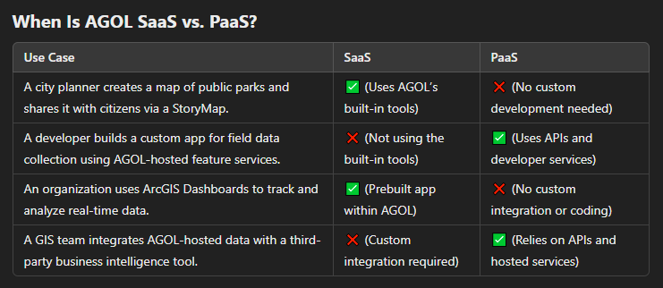
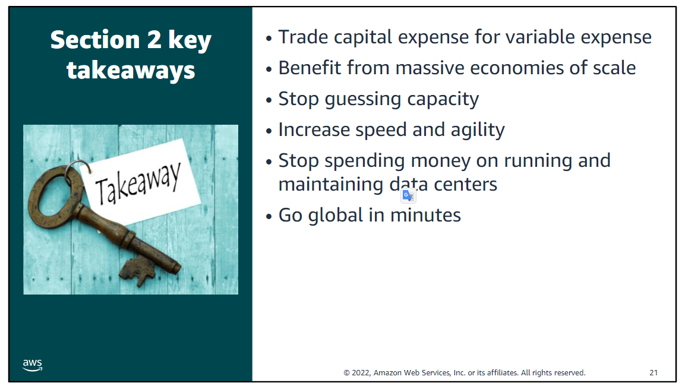

# Module 1 - Cloud Concepts Overview

[ALX Canvas](https://learning-core.theroom.com/courses/521/modules/items/238578)

## Objectives / Topics

- Introduction to Amazon Web Services (AWS)
- Define different types of cloud computing models
- Describe six advantages of cloud computing
- Recognize the main AWS service categories and core services
- Review the AWS Cloud Adoption Framework (AWS CAF)

 

## Labs / Activities

- [Knowledge Check](https://www.aws.training/Details/Curriculum?transcriptid=-NscDQNnt0KwQEi-zYfB8Q2&id=43078#modules)

 

## Section 1: Intro to Cloud Computing

**Cloud Computing:** The on-demand delivery of compute power, database, storage, applications, and other IT resources via the internet with pay-as-you-go pricing.These resources run on server computers that are located in large data centers in different locations around the world. When you use a cloud service provider like AWS, that service provider owns the computers that you are using. These resources can be used together like building blocks to build solutions that help meet business goals and satisfy technology requirements.

The most basic way to define what the “cloud” is that it is a computer located somewhere else that is accessed via the Internet and utilized in some way.
Cloud computing enables you to stop thinking of **infrastructure as hardware**, and instead think of (and use) it **as software**. Instead of buying, owning, and maintaining physical data centers and servers, you can access technology services on an as-needed basis.

### **Traditional Computing Model**

- Infrastructure as hardware

  - Hardware solutions: Require space, staff, physical security, planning, capital expenditure
  - Have a long hardware procurement cycle
  - Require you to provision capacity by guessing theoretical maximum peaks
  - Hardware procurement cycle that involves acquiring, provisioning, and maintaining on-premises infrastructure.

  With a hardware solution, you must ask if there is enough resource capacity or sufficient storage to meet your needs, and you provision capacity by guessing theoretical maximum peaks. If you don’t meet your projected maximum peak, then you pay for expensive resources that stay idle. If you exceed your projected maximum peak, then you don’t have sufficient capacity to meet your needs. And if your needs change, then you must spend the time, effort, and money required to implement a new solution

### **Cloud Computing Model**

- Infrastructure as software
- Software solutions:
  - Are flexible
  - Can change more quickly, easily, and cost-effectively than hardware solutions
  - Eliminate the undifferentiated heavy-lifting tasks
    You can elastically scale resources up and down in an automated fashion. With the cloud computing model, you can treat resources as temporary and disposable. The flexibility that cloud computing offers enables businesses to implement new solutions quickly and with low upfront costs

**Cloud service models vary on how much control you have over IT resources.**

As cloud computing has grown in popularity, several different service models and deployment strategies have emerged to help meet the specific needs of different users. Each type of cloud service model and deployment strategy provides you with a different level of control, flexibility, and management. Understanding the differences between these cloud service models and deployment strategies can help you decide what set of services is right for your needs
 

- Infrastructure as a Service (IaaS) - Most control
  - The basic building blocks for cloud IT
  - With access to networking features, computers (virtual or on dedicated hardware),
  - Operating Systems
  - Examples :
    - AWS
    - GCP
    - Azure
    - Esri Cloud Hosting Services
    - AWS-hosted ArcGIS Enterprise
- Platform as a Service (PaaS)
  - Reduce the need for you to manage the underlying infrastructure (usually hardware and operating systems)
  - Enable you to focus on the deployment and management of your applications.
  - Examples :
    - ArcGIS Developers
    - ArcGIS Online
    - Azure App Service / AWS Elastic Beanstalk
- Software as a Service (SaaS) - Least control
  - A completed product that the service provider runs and manages.
  - Software as a service refers to end-user applications
  - You do not have to think about how the service is maintained or how the underlying infrastructure is managed. You need to think only about how you plan to use that particular piece of software.
  - Examples: - ArcGIS Online / Platform - Google Earth Engine
     
    

### **Cloud computing deployment models**

1. Cloud "All-In" : fully deployed in the cloud, and all parts of the application run in the cloud.
   1. Applications in the cloud have either been created in the cloud or have been migrated from an existing infrastructure to take advantage of the benefits of cloud computing
   2. Cloud-based applications can be built on low-level infrastructure pieces or they can use higher-level services that provide abstraction from the management, architecting, and scaling requirements of core infrastructure
      1. Low Level ;It gives developers more control but also requires them to handle many responsibilities. Using EC2 , The developer is responsible for:
         - Installing the operating system.
         - Configuring networking.
         - Deploying the application.
         - Scaling resources based on demand.
      2. High Level : This approach leverages managed cloud services that abstract away most of the underlying complexity. Developers focus on building applications without worrying about infrastructure-level concerns like scaling, patching, or architecture. Like Lamada
2. Hybrid; This model enables an organization to extend and grow their infrastructure into the cloud while connecting cloud resources to internal systems
3. On-premse (Private Cloud) ;  **When you run a cloud infrastructure from your own data center, that’s called on-premises or
private cloud.**

Deploying resources on-premises, using virtualization and resource management tools, is sometimes called private cloud.In most cases, this deployment model is the same as legacy IT infrastructure, but it might also use application management and virtualization technologies to increase resource utilization. Or For Public CLoud Providers like AWS : Provide services that allow organizations to create isolated and secure environments within AWS infrastructure. These services emulate private cloud environments while benefiting from the scalability and managed services of a public cloud.  
	- On-Premises (Client-Site):
  	- Built and maintained at the client’s location.
  	- Requires significant upfront investment in hardware and IT expertise.
	- Hosted Private Cloud (Third-Party Data Center):
  	- A third-party provider manages the hardware, but the client has dedicated access to the virtualized resources.

### **Similarities between AWS and traditional IT**

Cloud computing can do almost anything the traditional IT can do.

 

## Section 2: Advantages of Cloud Computing

- Pay only for the resources you consume (variable cost vs upfront capital expenditure)

Trade capital expense for variable expense: Capital expenses (capex) are funds that a company uses to acquire, upgrade, and maintain physical assets such as property, industrial buildings, or equipment. Do you remember the data center example in the traditional computing model where you needed to rack and stack the hardware, and then manage it all? You must pay for everything in the data center whether you use it or not.

By contrast, a variable expense is an expense that the person who bears the cost can easily alter or avoid. Instead of investing heavily in data centers and servers before you know how you will use them, you can pay only when you consume resources and pay only for the amount you consume. Thus, you save money on technology. It also enables you to adapt to new applications with as much space as you need in minutes, instead of weeks or days. Maintenance is reduced, so you can spend focus more on the core goals of your business.

- Economies of scale achieved by aggregate of all users

By using cloud computing, you can achieve a lower variable cost than you can get on your own. Because usage from hundreds of thousands of customers is aggregated in the cloud, providers such as AWS can achieve higher economies of scale, which translates into lower pay-as-you-go prices
""
يعني ببساطة، كل ما الشركة تكبر وتستخدم موارد أكتر، كل ما تكلفة الوحدة تقل، وده بيساعد في توفير الفلوس على المدى الطويل

""

- Stop guessing capacity, Scaling on demand 
  

- Speed and flexibility - changes are software level, not hardware like traditional computing
  

In a cloud computing environment, new IT resources are only a click away, which means that you reduce the time it takes to make those resources available to your developers from weeks to just minutes. The result is a dramatic increase in agility for the organization because the cost and time that it takes to experiment and develop are significantly lower.

- Lower overhead due to not maintaining hardware and data centers

Focus on projects that differentiate your business instead of focusing on the infrastructure. Cloud computing enables you to focus on your own customers instead of the heavy lifting of racking, stacking, and powering servers

- Go global in minutes , Data centers are global, like a company's customer base

You can deploy your application in multiple AWS Regions around the world with just a few clicks. As a result, you can provide a lower latency and better experience for your customers simply and at minimal cost

 

## Section 3: Introduction to Amazon Web Services

**Web Service:** Any piece of software that makes itself available over the internet and uses a standardized format—such as Extensible Markup Language (XML) or JavaScript Object Notation (JSON) — for the request and the response of an application programming interface (API) interaction.

### What is AWS?

- AWS is a secure cloud platform that offers a broad set of global cloud-based products called services that are designed to work together.
- Because these products are delivered over the internet, you have on-demand access to AWS provides you with on-demand accessto compute, storage, network, database, and other IT resources and management tools.
- AWS offers flexibility; Your AWS environment can be reconfigured and updated on demand, scaled up or down automatically to meet usage patterns and optimize spending, or shut down temporarily or permanently. The billing for AWS services becomes an operational expense instead of a capital expense.
- You pay only for the individual services you need, for as long as you use them.
- AWS services work together like building blocks ; AWS services are designed to work together to support virtually any type of application or workload. Think of these services like building blocks, which you can assemble quickly to build sophisticated, scalable solutions, and then adjust them as your needs change

#### Categories of AWS services
1) Core Services / Basics Services ; refers to a broad and deep group of core cloud infrastructure services. 
   as you start your journey into the cloud. Initially, you only need to focus on a few ”core” services ==> Basics
2) Foundational Services 
3) Developer & Operational Services 

- There are many categories of AWS services, and each category has many services to choose from.

- Choose a service based on your business goals and technology requirements.

Which service you choose to use will depend on your business goals and technology requirements. In the example you just looked at, the solution made use of Amazon EC2 as the compute service. However, that is only one of many compute services that AWS offers. Here are some other AWS compute offerings that you might choose to use for the following example use cases:

- **Amazon EC2**: You want complete control over your AWS computing resources.
- **AWS Lambda**: You want to run your code and not manage or provision servers.
- **AWS Elastic Beanstalk**: You want a service that deploys, manages, and scales your web applications for you.
- **Amazon Lightsail**: You need a lightweight cloud platform for a simple web application.
- **AWS Batch**: You need to run hundreds of thousands of batch workloads.
- **AWS Outposts**: You want to run AWS infrastructure in your on-premises data center.
- **Amazon Elastic Container Service (Amazon ECS)**
- **Amazon Elastic Kubernetes Service (Amazon EKS)**
- **AWS Fargate**: You want to implement a containers or microservices architecture.
- **VMware Cloud on AWS**: You have an on-premises server virtualization platform that you want to migrate to AWS.

- There are three ways to interact with AWS services:
  1. AWS Management Console - Graphical interface
  2. Command Line Interface (CLI) - Access via discrete commands or scripts
  3. Software Development Kits (SDK) - Access directly from code

#### Simple solution example

For example, say you’re building a database application. Your customers might be sending data to your Amazon Elastic Compute Cloud (Amazon EC2) instances, which is a service in the compute category. These EC2 servers batch the data in one-minute increments and add an object per customer to Amazon Simple Storage Service (Amazon S3), the AWS storage service you’ve chosen to use. You can then use a nonrelational database like Amazon DynamoDB to power your application, for example, to build an index so that you can find all the objects for a given customer that were collected over a certain period. You might decide to run these services inside an Amazon Virtual Private Cloud (Amazon VPC), which is a service in the networking category.The purpose of this simple example is to illustrate that you can select web services from different categories and use them together to build a solution (in this case, a database application). Of course, the solutions you build can be quite complex.

 

## Section 4: The AWS Cloud Adoption Framework (AWS CAF)
As you learned so far in this module, cloud computing offers many advantages over the traditional model. However, for most organizations, cloud adoption does not happen instantly. Technology is one thing, but an organization also consists of people and processes, and these three elements must all be in alignment for successful cloud adoption. Cloud computing introduces a significant shift in how technology is obtained, used, and managed. It also shifts how organizations budget and pay for technology services. Cloud adoption requires that fundamental changes are discussed and considered across an entire organization. It also requires that stakeholders across all organizational units—both within and outside IT—support these new changes.

- AWS CAF provides guidance and best practices to help organizations build a comprehensive approach to cloud computing across the organization and throughout the IT lifecycle to accelerate successful cloud adoption.
- AWS CAF is organized into six perspectives and perspectives consist of sets of capabilities.

**Key Elements for Successful Cloud Adoption:**
1. **People**
2. **Process**
3. **Technology**

Business and technology leaders in an organization must understand the organization’s current state, target state, and the transition that is needed to achieve the target state so they can set goals and create processes for staff.

**Purpose:**
- Provides guidance and best practices.
- Helps identify gaps in skills and processes.
- Builds a comprehensive approach to cloud computing.
- Accelerates successful cloud adoption.

**Capabilities:**
- Each perspective consists of a set of capabilities.
- Capabilities cover distinct responsibilities managed by related stakeholders.
- Used to identify areas requiring attention.
- Helps create prescriptive work streams for a successful cloud journey.

**Steps for Cloud Migration:**
- Understand the current state.
- Define the target state.
- identify gaps in skills and processes
- Plan the transition to achieve the target state.
- Set goals and create processes for staff.

  **Focused on Business Capabilities**

  1. Business - IT is aligned with business needs
	Stakeholders from the Business perspective (for example, business managers, finance managers, budget owners, and strategy stakeholders) can use the AWS CAF to create a strong business case for cloud adoption and prioritize cloud adoption initiatives. Stakeholders should ensure that an organization’s business strategies and goals align with its IT strategies and goals.
	
     - IT Finance
     - IT Strategy
     - Benefits Realization
     - Business Risk Management
  2. People - training, staffing, and organizational changes 
	Stakeholders from the People perspective (for example, human resources, staffing, and people managers) can use the AWS CAF to evaluate organizational structures and roles, new skill and process requirements, and identify gaps. Performing an analysis of needs and gaps can help prioritize training, staffing, and organizational changes to build an agile organization.
	
     - Resource Management
     - Incentive Management
     - Career Management
     - Training Management
     - Organizational Change Management
  3. Governance - skills and processes align IT and business strategies and goals
	Stakeholders from the Governance perspective (for example, the Chief Information Officer or CIO, program managers, enterprise architects, business analysts, and portfolio managers) can use the AWS CAF to focus on the skills and processes that are needed to align IT strategy and goals with business strategy and goals. This focus helps the organization maximize the business value of its IT investment and minimize the business risks.
	
     - Portfolio Management
     - Program Project Management
     - Business Performance Measurement
     - License Management

  **Focused on Technical Capabilities**

  4. Platform - describe the architecture of the target state environment in detail
     - Compute Provisioning
     - Network Provisioning
     - Storage Provisioning
     - Database Provisioning
     - Systems and Solution Architechture
     - Application Development
  5. Security - the organization meets its security objectives
     - Identity and Access Management
     - Detective Control
     - Infrastructure Security
     - Data Protection
     - Incident Response
  6. Operations - define how daily, quarterly, and yearly business will be conducted
     - Service Monitoring
     - Application Performance Monitoring
     - Resource Inventory Management
     - Release Management / Change Management
     - Reporting and Analytics
     - Business Continuity / Disaster Recovery
     - IT Service Catalog

 

## Section 5 : Module Summary

**High Availability**
- Refers to a resource that is accessible when you attempt to access it.
- Example: An ATM that works every time you use it is highly available. If it displays an "Out of Order" sign, it is not highly available.

**Fault Tolerance**
- The ability to withstand a certain amount of failure and still remain functional.
- Refers to a system's ability to be self-healing and return to full capacity despite a failure.
- Example: A system that can fail in some way but still remain functional.

**Scalability**
- The ability to easily grow in size, capacity, and/or scope when required, particularly in response to demand.
- Example: If something cannot quickly grow in an easy manner, it is not scalable.

**Elasticity**
- The ability to not only grow (or scale) when required, but also to reduce or contract in size as needed.
- Example: A system that is elastic can scale to grow as needed, usually based on demand.

 

