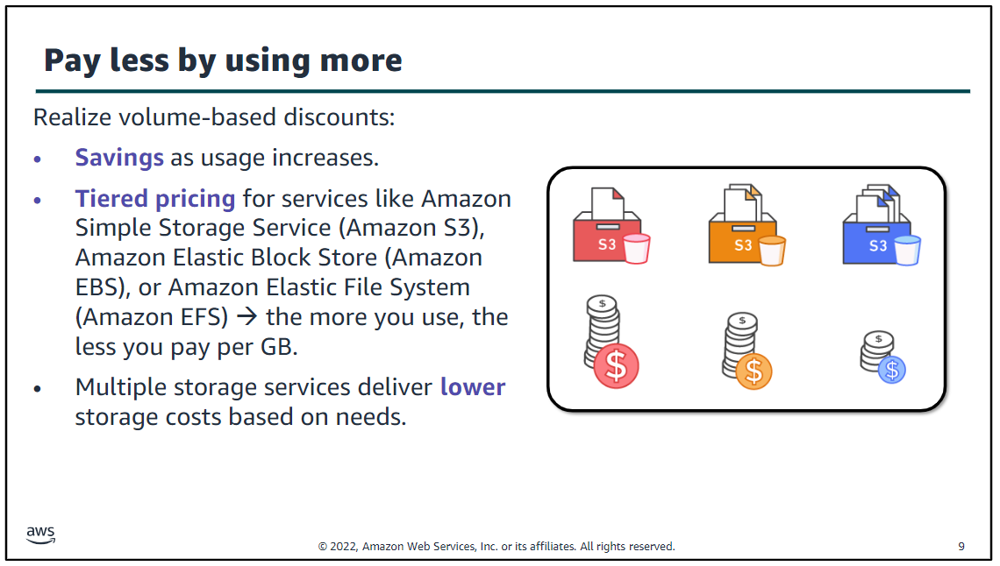
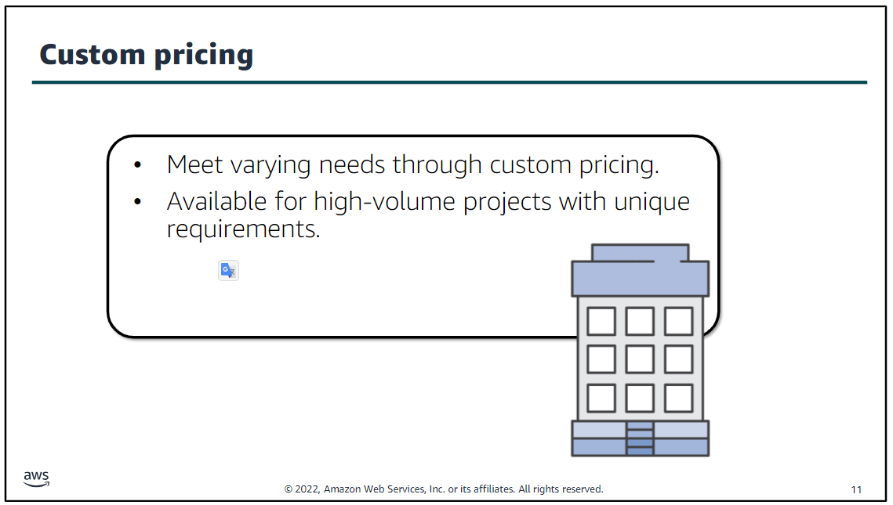
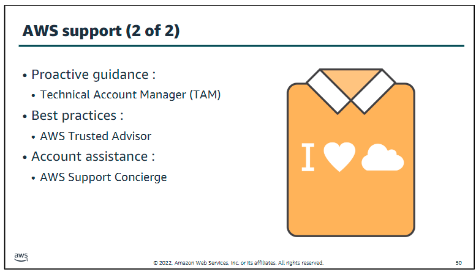

# Module 2 - Cloud Economics and Billing

[ALX Canvas](https://learning-core.theroom.com/courses/521/modules/items/238597)

## Objectives / Topics

- Explain the AWS pricing philosophy
  - Fundamentals of pricing
  - Total Cost of Ownership
- Recognize fundamental pricing characteristics
- Indicate the elements of total cost of ownership
- Discuss the results of the Simple Monthly Calculator
- Identify how to set up an organizational structure that simplifies billing and account visibility to review cost data.
- Identify the functionality in the AWS Billing Dashboard
- Describe how to use AWS Bills, AWS Cost Explorer, AWS Budgets, and AWS Cost and Usage Reports
- Identify the various AWS technical support plans and features

 

## Labs / Activities

- [Knowledge Check](https://www.aws.training/Details/Curriculum?transcriptid=-NscDQNnt0KwQEi-zYfB8Q2&id=43078#modules)
- [Cost Calculator Activity](http://d8rg5deuq9171.cloudfront.net/handouts/Activities/Module%202%20Activity%20-%20Total%20Cost%20of%20Ownership.pdf)
- [Simple Monthly Calculator](https://calculator.s3.amazonaws.com/index.html)
- [Support Plans Scavenger Hunt](http://d8rg5deuq9171.cloudfront.net/handouts/Activities/Module%202%20Activity%20-%20Support%20Plan.pdf)

 

## Section 1: Fundamentals of Pricing

### **Three Fundamental Cost Drivers with AWS**

1. Compute - charged by use time, varies by instance. For Me as Ahmed Alhusainy , the word instance was a little bit confusing.
 
An **instance** in AWS refers to a virtual server that you can use to run applications on the AWS cloud. When you launch an instance, you're essentially creating a virtual machine that runs on AWS's infrastructure. Here are a few key points to help clarify:

	A. **Types of Instances**: AWS offers various types of instances, each optimized for different use cases. For example:
   - **General Purpose**: Balanced resources for a variety of workloads.
   - **Compute Optimized**: High-performance processors for compute-intensive tasks.
   - **Memory Optimized**: Large amounts of RAM for memory-intensive applications.
   - **Storage Optimized**: High I/O performance for large data sets.

	B. **Instance Pricing**: The cost of an instance varies based on its type, size, and the region in which it is launched. For example, a compute-optimized instance will generally cost more than a general-purpose instance due to its higher performance capabilities.

	C. **Instance Lifecycle**: Instances can be started, stopped, and terminated as needed. When you stop an instance, you're not charged for compute resources, but you might still incur charges for storage.

	D. **Scaling**: You can scale your instances up or down based on your application's needs. This flexibility allows you to manage costs effectively by only using the resources you need.

 

5. Storage - charged per GB
6. Data Transfer - outbound transfers are aggregated cross servicesand then charged at the outbound data transfer rate.This charge appears on the monthly statement as AWS Data Transfer Out. Charged per GB, inbound transfers and data transfers between services in the same AWS Region typically have no charge. In most cases,there is no charge for inbound data transfer or for data transfer between other AWS services within the same AWS Region.

### **Paying for AWS**

This philosophy is what underlies AWS pricing. While the number and types of services offered by AWS have increased dramatically, our philosophy on pricing has not changed. At the end of each month, you pay for what you use. You can start or stop using a product at any time. No long-term contracts are required.

- Pay for what you use

  
	
	
	
  You can lower variable costs, so you no longer need to dedicate valuable resources to building costly infrastructure, including purchasing servers, software licenses, or leasing facilities. Quickly adapt to changing business needs and redirect your focus on innovation and invention by paying only for what you use and for as long as you need it. All AWS services are available on demand, require no long-term contracts, and have no complex licensing dependencies.
- Pay less when you reserve. Save up to 75% over on-demand pricing.

  

**Reserved Instances (RIs)** are a way to save money on Amazon Web Services (AWS) by committing to use a specific amount of capacity for a one- or three-year term. Here’s a breakdown of the three payment options:

- All Upfront Reserved Instance (AURI) -> Large Discount
- Partial Upfront Reserved Instance (PURI) -> Lower Discount
- No Upfront Payments Reserved Instance (NURI) -> Smallest Discount

- Pay less when you use more , Scale and save as usage increases. The more you use, the less you pay per GB

  - Tiered pricing for services like S3, EBS, EFS ; Pricing is tiered, which means that you pay less per GB when you use more
  - Multiple storage services deliver lowerstorage costs based on needs. As your organization evolves, AWS also gives you options to acquire services that help you address your business needs. For example, the AWS storage services portfolio offers options to help you lower pricing based on how frequently you access data and the performance that you need to retrieve it. Services like Amazon S3 Intelligent-Tiering automatically move data between different storage classes based on access patterns. This automation helps optimize costs without requiring manual intervention.
    

- Pay even less as AWS grows , Save as AWS grows

  - Another benefit of AWS growth is that future, higher-performing resources replace current ones for no extra charge.
  - the word of economies of scale :  AWS operates on a massive scale, serving millions of customers worldwide. This large customer base allows AWS to spread its infrastructure costs over a vast number of users, reducing the cost per user.
  
    

- Custom Pricing
  - Meet varying needs through custom pricing.
  - Available for high-volume projects with unique requirements.
    

To help new AWS customers get started in the cloud, AWS offers a free usage tier (the AWSFree Tier)for new customers for up to 1 year.The AWS Free Tier applies to certain services and options. If youare a new AWS customer, you can run a free Amazon Elastic Compute Cloud (Amazon EC2) T2 micro instance for a year, while also using a free usage tier for Amazon S3, Amazon Elastic Block Store (Amazon EBS), Elastic Load Balancing, AWS data transfer, and other AWS services.To learn more, see AWS Free Tier at [link](https://aws.amazon.com/free/?all-free-tier.sort-by=item.additionalFields.SortRank&all-free-tier.sort-order=asc&awsf.Free%20Tier%20Types=*all&awsf.Free%20Tier%20Categories=*all)

#### The services below are free but there might be charges associated with other AWS services that are used alongside these services.

- Amazon VPC
- Elastic Beanstalk
- Auto Scaling
- AWS CloudFormation
- AWS Identity and Access Management

  

While some AWS services themselves might not have direct charges, using them often involves other AWS resources that do incur costs. Here are a few examples:

- Auto Scaling:
  - Amazon EC2: When you set up Auto Scaling to handle increased traffic, additional EC2 instances are launched automatically. You will be charged for these instances based on the instance type and usage duration.
- Data Transfer:
  - Amazon S3: Storing data in S3 might be free or low-cost, but transferring data out of S3 to the internet or other AWS regions can incur data transfer charges.
- Storage:
  - Amazon RDS: While the database service itself might have a base cost, the underlying storage (e.g., EBS volumes) and backup storage can add to the overall cost.
    Networking:
  - Elastic Load Balancing (ELB): Using a load balancer to distribute traffic across multiple EC2 instances incurs charges based on the amount of data processed and the number of load balancer hours.
- Monitoring and Logging:
  - Amazon CloudWatch: Monitoring your AWS resources with CloudWatch involves charges for custom metrics, dashboards, and alarms.

It's important to review the pricing details for each AWS service you plan to use and consider how they interact with other services. AWS provides a Pricing Calculator to help estimate costs based on your specific usage patterns.
Though there is no charge for these services, there might be charges associated with other AWS services used with these services. For example, when you automatically scale additional EC2 instances, there will be charges for those instances.\* Note: The main difference between AWS accounts and AISPL accounts is the seller of record. AWS accounts are administered by Amazon Web Services, Inc., but AISPL accounts are administered by Amazon Internet Services Private Limited. If you used an Indian address when you created your account, your account's default seller of record is AISPL.By default, AISPL accounts are billed in Indian Rupees (INR).

 

## Section 2: Total Cost of Ownership

**Total Cost of Ownership (TCO):** The financial estimate to help identify direct and indirect costs of a system **(On-premises versus cloud)**

- The difference between these two options is how they are deployed.
- Compare the costs of running an entire infrastructure environment or specific workload on-premises versus on AWS
- Budget and build the business case for moving to the cloud
  An on-premises infrastructure is installed locally on a company’s own computers and servers. There are several fixed costs, also known as capital expenses, that are associated with the traditional infrastructure.
  Capital expenses include facilities, hardware, licenses, and maintenance staff. Scaling up can be expensive and time-consuming. Scaling down does not reduce fixed costs.
  A cloud infrastructure is purchased from a service provider who builds and maintains the facilities, hardware, and maintenance staff.
  A customer pays for what is used. Scaling up or down is simple. Costs are easy to estimate because they depend on service use.
  Using on-premises IT involves a discussion that is based on capital expenditure, long planning cycles, and multiple components to buy, build, manage, and refresh resources over time.Using the AWS Cloud involves a discussion about flexibility, agility, and consumption-based costs

  

### **TCO Considerations**

ou might want to compare the costs of running an entire infrastructure environment for a specific workload in an on-premises or collocation facility to the same workload running on a cloud-based infrastructure.

1. Server Costs
   - Hardware: Server, rack chassis power distribution units (PDUs), top-of-rack (TOR) switches, and maintenance
   - Software: Operating system (OS), virtualization licenses, and maintenance
   - Facilities: Space, power, and cooling
2. Storage Costs
   - Hardware: Storage disks, storage area network (SAN) or Fibre Channel (FC) switches
   - Storage administration costs
   - Facilities: Space, power, and cooling
3. Network Costs
   - Network Hardware: Local area network (LAN) switches, load balancer bandwidth costs
   - Network administration costs
   - Facilities: Space, power, and cooling
4. IT Labor Costs
   - Server administration costs
5. Software Cost ; developement , database , management , middle tier ...etc.
6. Upgrade , maintenance , building security , taxes , and even jobs.

When you compare an on-premises to cloud solution, it is important to accurately assess the true costs of both options.
With the cloud, most costs are upfront and readily calculated. For example, cloud providers give transparent pricing based on different usage metrics, such as RAM, storage, and bandwidth, among others.
Pricing is frequently fixed per unit of time. Customers gain certainty over pricing and are then able to readily calculate costs based on several different usage estimates.
Compare this process to on-premises technology. Though they are sometimes difficult to determine, calculations of in-house costs must take into account all:
•Direct costs that accompany running a server—like power, floor space, storage, and IT operations to manage those resources.
•Indirect costs of running a server, like network and storage infrastructure.

The AWS Pricing Calculator enables you to name your estimate and create and name groups of services. Groupsare containers that you add services to in order to organize and build your estimate.
You can organize your groups and services by cost-center, department, product architecture, etc.

[Cost Calculator Activity](http://d8rg5deuq9171.cloudfront.net/handouts/Activities/Module%202%20Activity%20-%20Total%20Cost%20of%20Ownership.pdf) 
[Simple Monthly Calculator](https://calculator.aws/#/)

AWS Pricing Calculator estimates are broken into:•The total for your first 12 months –The total estimate for your current group and all of the services and groups in your current group. 
It combines the upfront and monthly estimates. 
•Your total upfront –How much you are estimated to pay upfront as you set up your AWS stack.
•Your total monthly –How much you're estimated to spend every month while you run your AWS stack.

Within a group, you can see how much each service is estimated to cost. 
If you want to price out different ways to build your AWS setup, you can use different groups for each variation of your setup and compare the estimates for the different setups

Cloud Total Cost of Ownership defines what will be spent on the technology after adoption—or what it costs to run the solution. 
Typically, a **TCO analysis** looks at the **as-is** on-premises infrastructure and compares it with the cost of the **to-be** infrastructure state in the cloud. 
While this difference might be easy to calculate, it might only provide a narrow view of the total financial impact of moving to the cloud.

**A return on investment (ROI)** analysis can be used to determine the value that is generated while considering spending and saving. 
This analysis starts by identifying the hard benefits in terms of direct and visible cost reductions and efficiency improvements. 

Next, soft savings are identified. Soft savings are value points that are challenging to accurately quantify, but they can be more valuable than the hard savings. 
It is important for you to understand both hard and soft benefits to understand the full value of the cloud. 
Soft benefits include:
			•Reusing service and applications that enable you to define (and redefine solutions) by using the same cloud service
			•Increased developer productivity
			• Improved customer satisfaction 
  		•Agile business processes that can quickly respond to new and emerging opportunities.
			•Increased global reach
			
			
**Case Study Findings**

 

## Section 3: Billing

### **AWS Organizations**

**AWS Organizations:** An account management service that enables you to consolidate multiple AWS accounts into an organization that you create and centrally manage. 
AWS Organizations includes account management and consolidated billing capabilities that enable you to better meet the budgetary, security, and compliance needs of a business.

#### Key Features and Benefits

- Policy based account management
- Group based account management
- Application programming interfaces (APIs) that automate account management
- Centrally managed access policies across multiple AWS accounts.
- Controlled access to AWS services.
- Automated AWS account creation and management.
- Consolidated billing across multiple AWS accounts.

The diagram shows a basic organization, or root, that consists of seven accounts that are organized into four organizational units (or OUs). An OU is a container for accounts within a root. An OU can also contain other OUs.This structure enables you to create a hierarchy that looks like an upside-down tree with the root at the top.
The branches consist of child OUsand they move downward until they end in accounts,which are like the leaves of the tree.
When you attach a policy to one of the nodes in the hierarchy, it flows down and it affects all the branches and leaves. This example organization has several policies that are attached to some of the OUs or are attached directly to accounts

An OU can have only one parent and, currently, each account can be a member of exactly one OU. An account is a standard AWS account that contains your AWS resources. 
You can attach a policy to an account to apply controls to only that one account.

#### Security

- Control access with AWS Identity and Access Management (IAM)
- IAM policies enable you to allow or deny access to AWS services for users, groups, and roles.
- Service control policies (SCPs) enable you to allow or deny access to AWS services for individuals or group accounts in an organizational unit (OU).

#### Setup

1. Create organization
2. Create organizational units
3. Create service control policies
4. Test restrictions

There are restrictions on names that you can create in AWS Organizations,which includes names of accounts, OUs, roots, and policies.Names must be composed of Unicode characters and not exceed 250 characters in length.AWS Organizations has several maximum and minimum values for entities

#### Accessing AWS Organizations

- AWS Management Console
- AWS Command Line Interface (AWS CLI) tools
- Software Development Kits (SDKs)
- HTTPS Query Application Programming Interfaces (API)

### **AWS Billing and Cost Management**

**AWS Billing and Cost Management:** The service that you use to pay your AWS bill, monitor your usage, and analyze and control your costs.
Billing and Cost Management enables you to forecast and obtain a better idea of what your costs and usage might be in the future so that you can plan ahead.
You can set a custom time period and determine whether you would like to view your data at a monthly or daily level of granularity.

With the filtering and grouping functionality, you can further analyze your data using a variety of available dimensions. The AWS Cost and Usage Report Tool enables you to identify opportunities for optimization by understandingyour cost and usage data trends and how you are using your AWS implementation.

The AWS Billing Dashboard lets you view the status of your month-to-date AWS expenditure, identify the services that account for the majority of your overall expenditure, and understand at a high level how costs are trending.One of the graphs that is located on the dashboard is the Spend Summary.The Spend Summary shows you how much you spent last month, the estimated costs of your AWS usage for the month to date, and a forecast for how much you are likely to spend this month.Another graph is Month-to-Date Spend by Service,which shows the top services that you use most and the proportion of costs thatare attributed to that service.

#### Tools

- **AWS Budgets:**  
  - Uses the cost visualization that is provided by Cost Explorer to show you the status of your budgets and to provide forecasts of your estimated costs. 
  - It gives you the ability to set custom budgets that alert you when your costs or usage exceed (or are forecasted to exceed) your budgeted amount. 
  - You can also use it to set reservation utilization or coverage targets and receive alerts when your utilization drops below the threshold you define.
  - Budgets can be tracked at the monthly, quarterly, or yearly level, and you can customize the start and end dates. 
  - Budget alerts can be sent via email or via Amazon Simple Notification Service (Amazon SNS).
	
- **AWS Cost and Usage Report:** Tracks your AWS usage and provides estimated charges associated with your account. is a single location for accessing comprehensive information about your AWS costs and usage. This tool lists the usage for each service category that is used by an account (and its users) in hourly or daily line items,and any tax that you activated for tax allocation purposes.
- **AWS Cost Explorer:** Visualize, understand, and manage AWS costs and usage over time.

 

## Section 4: Technical Support

AWS Support offers a range of plans that provide access to tools and expertise that support the success and operational health of your AWS solutions.
All support plans provide 24/7 access to customer service, AWS documentation, whitepapers, and support forums.

- Proactive Guidance: Technical Account Manager (TAM) , AWS SupporthasTechnical Account Managers (TAMs)who are designated as that user’s primary point of contact. The TAM can provide guidance, architectural review, and continuous ongoing communication to keep you informed and prepared as you plan, deploy, and optimize your solutions.
- Best Practices: AWS Trusted Advisor ; if you want to ensure that you follow best practices to increase performance and fault tolerance in the AWS environment, AWS SupporthasAWS Trusted Advisor. AWS Trusted Advisor is like a customized cloud expert.It is an online resource that checks for opportunities to reduce monthly expenditures and increase productivity
- Account Assistance: AWS Support Concierge ; For account assistance, the Support Concierge is a billing and account expert who will provide quick and efficient analysis on billing and account issues. The concierge addresses all non-technical billing and account-level inquiries

### **Support Plans**

- **Basic Support:** Resource Center access, Service Health Dashboard, product FAQs, discussion forums, and support for health checks
  - 24/7 access to customer service, documentation, whitepapers and support forums.
  - Access to six core Trusted Advisor checks.
  - Access to Personal Health Dashboard
- **Developer Support:** Support for early development/testing on AWS
  - •Want access to guidance and technical support.
  - •Are exploring how to quickly put AWS to work.
  - •Use AWS for non-production workloads or applications
- **Business Support:** Customers that run production workloads
  - •Run one or more applications in production environments.
  - •Have multiple services activated, or use key services extensively.
  - •Depend on their business solutions to be available, scalable, and secure.
- **Enterprise Support:** Customers that run business and mission-critical workloads
  - Focus on proactive management to increase efficiency and availability.
  - Build and operate workloadsthatfollow AWS best practices.
  - Use AWS expertise to support launches and migrations.
  - Use a Technical Account Manager (TAM),who provides technical expertise for the full range of AWS services and obtains a detailed understanding of your use case and technology architecture. 
  - The Technical Account Manager is the primary point of contact for ongoing support needs

Support response times vary based on plan and case severity. Basic offers no case support, all other support ranges from 24 hours to 15 minutes or less.

 

### **Module Summary**

---

 

[Support Scavenger Hunt](http://d8rg5deuq9171.cloudfront.net/handouts/Activities/Module%202%20Activity%20-%20Support%20Plan.pdf)

[Knowledge Check](https://www.aws.training/Details/Curriculum?transcriptid=-NscDQNnt0KwQEi-zYfB8Q2&id=43078#modules)
