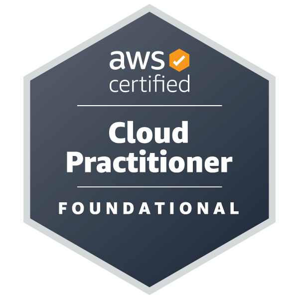
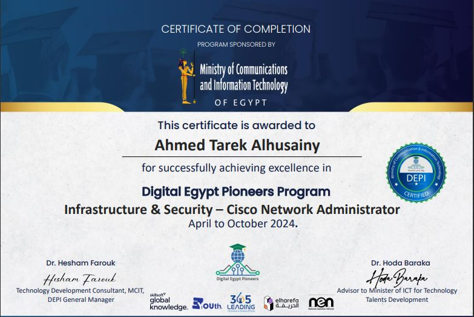
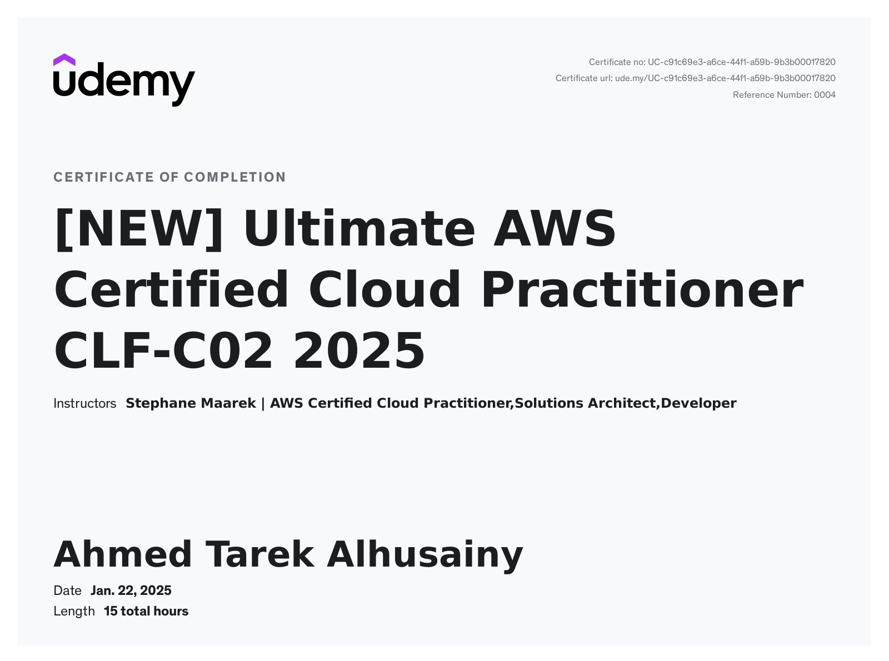
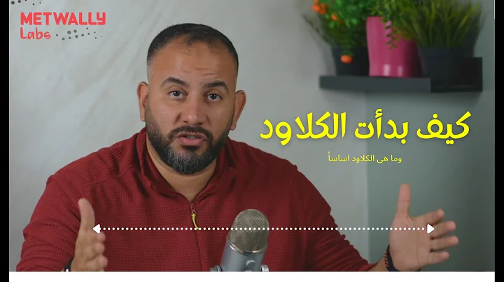
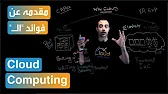
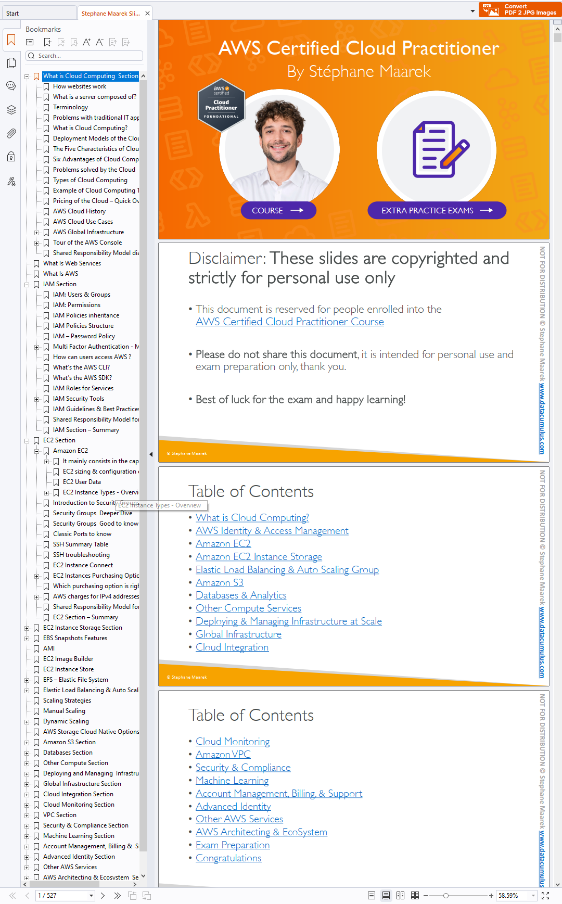

# 🌥️ CCP Cloud Practitioner Self-Study Guide and Materials
    

      Hello! I'm <strong>Ahmed Tarek Alhusainy</strong>, Welcome to the **CCP Cloud Practitioner AWS Academy Self-Study Guide and Materials (Version 2.0.13)**! 🚀
This comprehensive guide is designed to help you ace your cloud certification journey. Whether you're a beginner or looking to refresh your knowledge, this guide has got you covered. ✅  
      👉 <a href="https://ahmedalhusaini.github.io/AWS-Cloud-Practitioner-SelfStudy-Materials/" target="_blank">Open the Repo Navigator Website For Non GitHub Familiar</a>

---

## ℹ️ Disclaimer

The materials in this guide are not all created by me but were collected through research and peers recommendation. My intention is not to claim ownership of any content but to provide a resource that can assist others in their cloud certification journey, just as it helped me. I hope this compilation of resources benefits everyone seeking to learn and grow in the field of cloud computing. 🎯

### **Don't Feel Overwhelmed! Use the SQ4R Study Strategy 📖**

To effectively navigate through the study materials, I recommend using the **SQ4R** method. This structured approach enhances comprehension and retention:

1. **S – Survey**: Quickly scan through the material to get an overview.
2. **Q – Question**: Formulate questions about the topics you are about to study.
3. **R – Read**: Read actively while looking for answers to your questions.
4. **R – Recite**: Summarize what you learned in your own words.
5. **R – Review**: Go over the material periodically to reinforce your learning.
6. **R – Reflect**: Connect the new knowledge with what you already know.

### **Summary of Study Materials 📚**

Each resource is highly recommended by different peers. Some prefer **DION’s training notes**, others find **Stephan’s Udemy course** more effective. Choose what works best for you!

1. 📘 **Udemy Course PDF Slides**
2. 📝 **Public Online Self-Study Notes (DION Training)**
3. 🌐 **AWS Official Materials**
4. 📜 **Cheat Sheets & Concept PDFs**

Personally, I found **Stephan's PDF with concept assets** the most useful! 🚀

---

## 🎖️ Achievements

### 🏅 Cloud Foundation Badge

I earned my first milestone in cloud computing: **Cloud Foundation Badge**

### 🏆 AWS Certified Cloud Practitioner

🌟 I have officially earned the Amazon Web Services (AWS) Certified Cloud Practitioner certification! 🏅✨
This milestone reflects my commitment to hashtag#architecting the next generation of hashtag#spatial hashtag#infrastructure, leveraging cloud concepts, and advancing in the ever-evolving tech world.
From understanding the core AWS services to exploring cloud economics, this journey has been both challenging and rewarding. 🚀
But that’s not all! I've delved into the fascinating world of GIS Edge and Esri hashtag#ArcGIS hashtag#Enterprise hashtag#deployment hashtag#scenarios, hashtag#migration hashtag#strategies, and much more.
This achievement comes after huge efforts in studying infrastructure and security, as I have graduated from the Digital Egypt Pioneers Initiative - DEPI., Cisco CCNA/P
I'm excited to continue leveraging cloud technologies to drive innovation and efficiency in GIS solutions. The future is cloud-bound! 🌐🚀

### 👨‍🏫 Squad Leader Role

I was honored to be introduced as a **Squad Leader**, guiding and collaborating with an amazing team.

### 📜 Get Udemy Certificate

---

## 📚 Study Resources

As I share my journey with you, at the beginning, I discovered AWS Academy materials. While they are great as PDFs for printable study notes, they felt a bit too basic and not enough for a first deep dive into the cloud. I faced numerous challenges in understanding the "HOW To & Why," not just the "What is."

So, I did some research on Udemy and YouTube, and here are the learning resources I found:

### 🧠 Cloud Computing Concepts (Arabic) 🌍

- 🎥 **Metwally Labs**: [Introduction to Cloud Computing](https://youtu.be/lUnmgVkknF8)

  - Description: Discusses cloud concepts, their origins, and the revolutionary steps in each IT service delivery.
    

- 🎥 **Cloud Simplified**: [Cloud Benefits Explained](https://youtu.be/wlypwB5U4vI?list=PLJZLxa-J0VZTP_zTpUdzFrZxeB1NeUDkb)
  - Description: Talks about the benefits of the cloud and why we should move to it, highlighting various reasons beyond just cost reduction.
    

### 📖 Udemy Course by Stephan 🎓

I purchased and completed a highly-rated Udemy course by Stephan

- 📌 **[AWS Certified Cloud Practitioner Course](https://www.udemy.com/course/aws-certified-cloud-practitioner-new/)**

Inside the folder of the course materials, you will have:

- Codes used in the course
- Slides with my idea to recap quickly through drawing a complete index of each concept and topic inside the PDF so I can search, query, and get the bird's eye view quickly, very quickly, while building the concepts step by step in my mind through the journey
  

### 🎥 CloudKode Arabic Course

- 📌 **[YouTube Playlist](https://www.youtube.com/playlist?list=PLZmPGUyBFvUqo76bXGnXq9EofsaV2d8K5)**

### 🎥 Cloud Simplified Arabic Course

- 📌 **[YouTube Playlist](https://www.youtube.com/playlist?list=PLJZLxa-J0VZTP_zTpUdzFrZxeB1NeUDkb)**

Those two Arabic playlists are amazing, short, to the point, and not as comprehensive as the Udemy end-to-end full course. However, they helped me gain the concepts with metaphors in my mind, so I got extra benefit from the Stephan Udemy course. All the materials from the course, as the instructor put them in the YouTube channel, are here in the ArabicChanel folder with all summary files, PPTs, and so on.

---

### 🖥️ AWS Academy Slides and Hands-On Labs

The materials are just for scanning, with animated graphs and general concepts, but your main studying document is from the UDEMY STEPHAN PDF.

### 🧠 Exam Preparation Kit

I have put all my effort into gathering exam preparation tips and tricks, exam sets, questions from other peer GitHub repos, a free book, links for dumps, AWS free online exam sets, and finally ALX Resources Exam Set with explanations. "It's Amazing by the way."

So, in the Exam Preparation folder, you will have ordered as I recommend to go through:

- ✅**Concepts Texts**
- ✅**ALX Resources Bank: Exam Questions with Explanation**
- ✅**Complete Set of Exams**
- ✅**Self-Study Notes and Cheat Sheet**
- ✅**Anki Deck for Question Rehearsal**
- ✅**Knowledge Checks**
- ✅**Practice Questions**
- ✅**Online Exam Questions Sets**
  - [ExamTopics-AWS-Last updated on Feb. 21, 2025](https://www.examtopics.com/exams/amazon/aws-certified-cloud-practitioner/view/1/)
  - [Knowledage Check Playlist short Reels](https://www.youtube.com/playlist?list=PLAMhkzmvYCLMDZVFXJKheoeyKgIeKd4j5)
  - [AWS Free Exam Sample - Skillbuilder](https://explore.skillbuilder.aws/learn/courses/14050/aws-certified-cloud-practitioner-official-practice-question-set-clf-c02-english)

Final Note: If you have reserved a time for the exam and want to scan or reference another explanation or instructor to enrich your study, I would recommend taking two weeks for exam preparation. Go through my recommended set of questions and also review any of these YouTube full courses:

- 🔗[Course 1](https://www.youtube.com/watch?v=NhDYbskXRgc)
- 🔗[Course 2](https://www.youtube.com/watch?v=Uq5w1lnKzlk)

And for Arabic natives:
This video from Cloud Simplified is amazing and talks about how to prepare for the exam:

- 🔗 [Cloud Simplified Exam Preparation](https://www.youtube.com/watch?v=eN1KYu9Whe4)

AWS Cloud Quest: Cloud Practitioner:

- 🔗 [AWS Cloud Quest: Cloud Practitioner](https://explore.skillbuilder.aws/learn/courses/11458/aws-cloud-quest-cloud-practitioner)

---

## ☕ Support My Work

If you found this helpful, consider Supporting ☕ My Mission – Empowering Careers, GIS Innovation , GIS DevOps & Cloud Learning 🚀

- [☕ Buy Me a Coffee](https://buymeacoffee.com/ahmedalhusainy)
- 📺 [Subscribe to My YouTube Channel](https://www.youtube.com/@GISOverflow)
- 💻 [Follow My GitHub](https://github.com/AhmedAlhusaini)
- 💻 [Book A Meeting To Support You](https://tidycal.com/ahmedtarekalhusainy)

---

## 🔗 Connect With Me

Feel free to reach out and connect:

- [LinkedIn](https://www.linkedin.com/in/ahmedalhusainy/)

Happy learning and best of luck on your cloud journey! 🌟🚀
